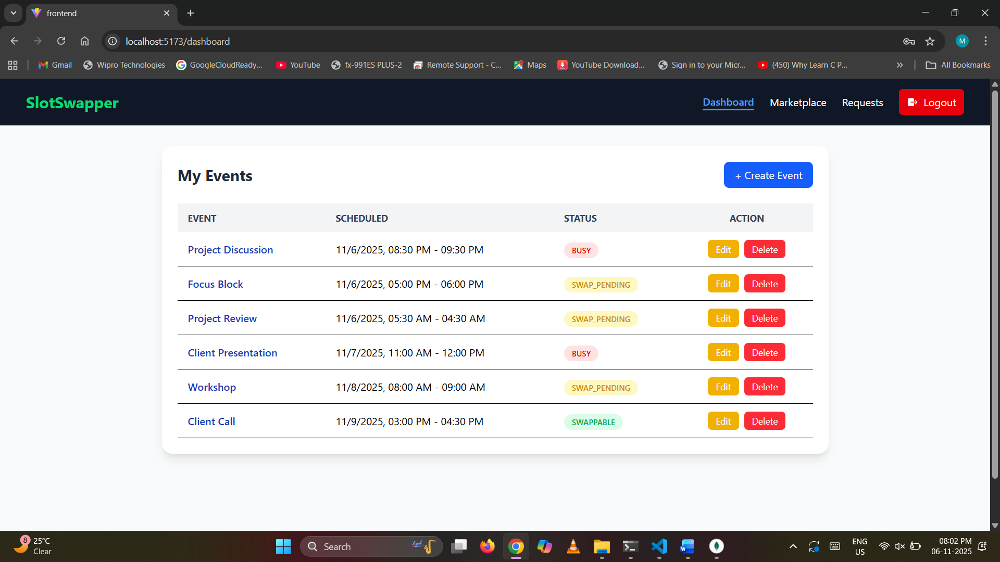
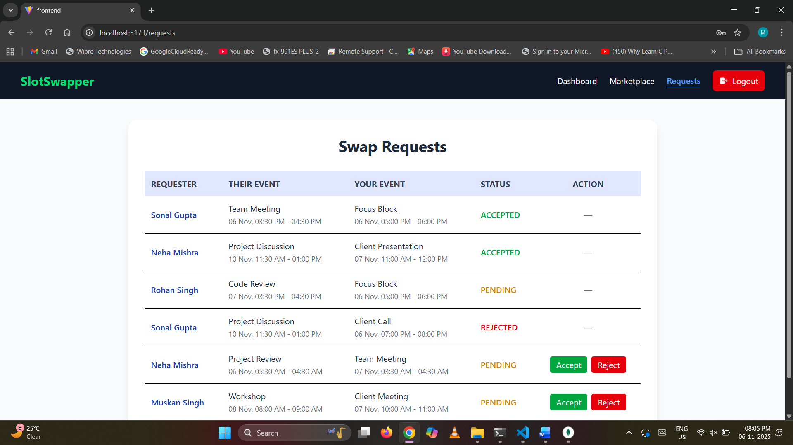
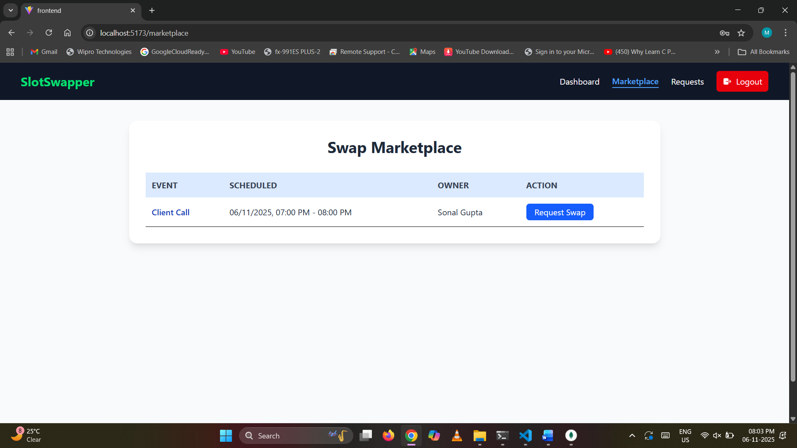

# SlotSwapper   

SlotSwapper is a web-based platform that allows users to **create, manage, and swap event slots** with others. It provides a secure and user-friendly interface for event organizers and participants to manage their schedules effectively.  

## 🚀Project Overview  

This project consists of:  
- **Frontend:** React.js (Vite) for a responsive and modern user interface.  
- **Backend:** Node.js + Express.js for handling APIs and authentication.  
- **Database:** MongoDB for storing users, events, and swap requests.  
- **Authentication:** JWT-based secure login and logout with cookie handling.  

### 🔧 Key Features  
- User Signup & Login (JWT Authentication)  
- Create, Edit, Update, and Delete Events  
- View all available events in the **Marketplace**  
- Send and manage **Swap Requests** with other users  
- Responsive Navbar (appears only on Dashboard, Marketplace, and Requests pages)  
- Toast notifications for success/error messages  

---

## 📸 Project Screenshots

### 🏠 Dashboard Page


### 🔄 Swap Requests Page


### 🛒 Marketplace Page


---

## 💻 Local Setup Instructions  

### 1️. Clone the Repository  
```bash
git clone https://github.com/your-username/slotswapper.git
cd slotswapper
```

### 2. Install Dependencies

Backend
```bash
cd backend
npm install
```

Frontend
```bash
cd ../frontend
npm install
```

### 3. Environment Variables

Create a .env file in the backend directory with the following:
```
PORT=any_port_number_for_localhost
MONGO_URI=your_mongodb_connection_string
JWT_SECRET=your_secret_key
FRONTEND_URL=https://your-frontend.vercel.app
```

### 4. Run the Project

Start Backend Server
```
cd backend
npm run dev
```

Start Frontend
```
cd ../frontend
npm run dev
```

Now open your browser and go to:
👉 http://localhost:5173

## 🌐 API Endpoints

| Method     |	      Endpoint                         |        Description                     |
|------------|-----------------------------------------|----------------------------------------|
| POST       |  /api/user/signup                       |   Register a new user                  |
| POST       |  /api/user/login                        |   Authenticate and login user          |
| GET        |  /api/events/                           |   Fetch all created events             |
| GET        |  /api/events/:id                        |   Fetch an event                       |
| POST       |  /api/events/                           |   Create a new event                   |
| PUT        |  /api/events/:id                        |   Update an event                      |
| DELETE     |  /api/events/:id                        |   Delete an event                      |
| GET        |  /api/swaps/swappable-slots             |   Fetch all swappable event slots      |
| POST       |  /api/swaps/request                     |   Create a slot swap request           |
| GET        |  /api/swaps/                            |   Fetch all swap requests              |
| PUT        |  /api/swaps/respond/:requestId          |   Respond to a request (accept/reject) |

## Example Swap Request Flow

1. User A sends a swap request to User B for a specific slot.
2. User B views the request on the Requests Page.
3. User B can Accept or Reject the request.
4. On Accept, both slots’ owners are swapped, and their status becomes BUSY.
5. On Reject, the status reverts to SWAPPABLE.

## 🧠 Design Choices

- **JWT Authentication**: Chosen for secure stateless login sessions.
- **Axios with Credentials**: To handle cookies and maintain login sessions seamlessly.
- **Protected Routes**: Users must be logged in to access Dashboard, Marketplace, or Requests.
- **Conditional Navbar**: Navbar appears only after login on selected routes.

## ⚠️ Challenges Faced

- Integrating authentication across frontend and backend using cookies.
- Managing conditional rendering for Navbar visibility.
- Handling real-time updates for event and swap request status.
- Ensuring responsive design across all devices.

## 💻 Tech Stack

- **Frontend**: React.js, Tailwind CSS, Axios
- **Backend**: Node.js, Express.js, MongoDB
- **Hosting**: Vercel (Frontend), Render (Backend)

## ☁️ Deployment

- **Frontend**: [Vercel](https://slot-swapper-gamma-taupe.vercel.app)
- **Backend**: [Render](https://slotswapper-m6h4.onrender.com)


## 👨‍💻 Author

Muskan Priya

🌐 Live Project: https://slot-swapper-gamma-taupe.vercel.app/